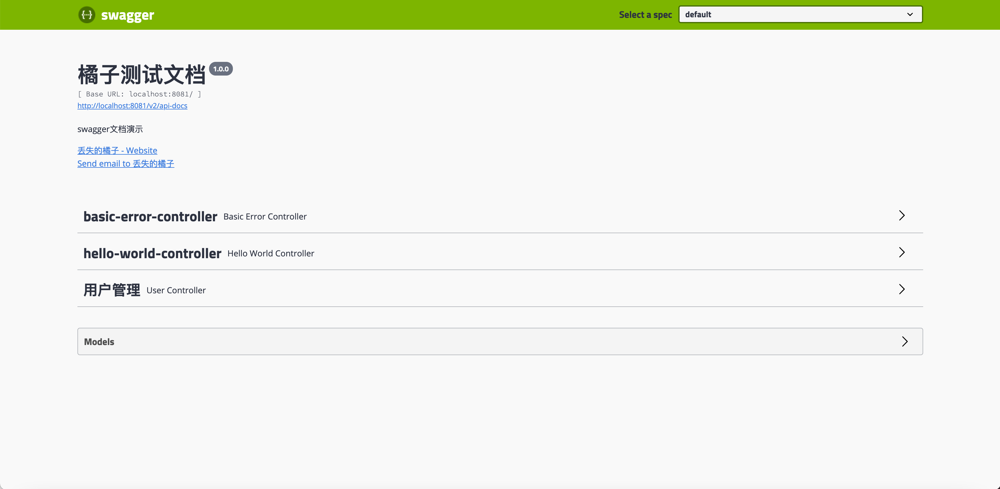

# Swagger-demo
Swagger演示

#### SpringBoot集成Swagger

> 引入Swagger相关依赖
```xml
<!-- swagger组件 -->
<dependency>
    <groupId>io.springfox</groupId>
    <artifactId>springfox-swagger2</artifactId>
    <version>2.9.2</version>
</dependency>
<!-- swagger-ui界面组件 -->
<dependency>
    <groupId>io.springfox</groupId>
    <artifactId>springfox-swagger-ui</artifactId>
    <version>2.9.2</version>
</dependency>
```

#### SwaggerConfig类

- 配置Swagger相关信息
- 如果配置了启用环境，需要在配置文件配置相关环境信息，否则无法访问

> 访问swagger-ui界面地址：http://localhost:8081/swagger-ui.html

#### 访问效果图



#### 常用注解

- @Api：写在Controller类上，标识这个类是Swagger资源
- @ApiOperation：写在 Controller 里的具体方法上，给当前具体的接口添加注释，表示一个 HTTP 请求的操作
- @ApiParam：用于方法，参数，给字段添加注释
- @ApiImplicitParam：用于方法，给单独的请求参数 添加注释
- @ApiImplicitParams：用于方法，包含多个 @ApiImplicitParam，给多个参数添加注释
- @ApiModel：用于实体类，给实体类添加注释
- @ApiModelProperty：用于实体类具体的属性，给实体类属性添加注释
- @ApiIgnore：用于类/方法/参数，表示这个类/方法/参数被忽略

#### SpringBoot集成knife4j

 knife4j是 Swagger 生成 API 文档的增强解决方案
 
 > 引入knife4j相关依赖

```xml
<dependency>
    <groupId>com.github.xiaoymin</groupId>
    <artifactId>knife4j-spring-boot-starter</artifactId>
    <version>1.9.6</version>
</dependency>
```
#### SwaggerConfig类启用knife4j

```java
@EnableSwaggerBootstrapUi
```

> 访问knife4j地址：http://localhost:8081/doc.html

#### 访问效果图

